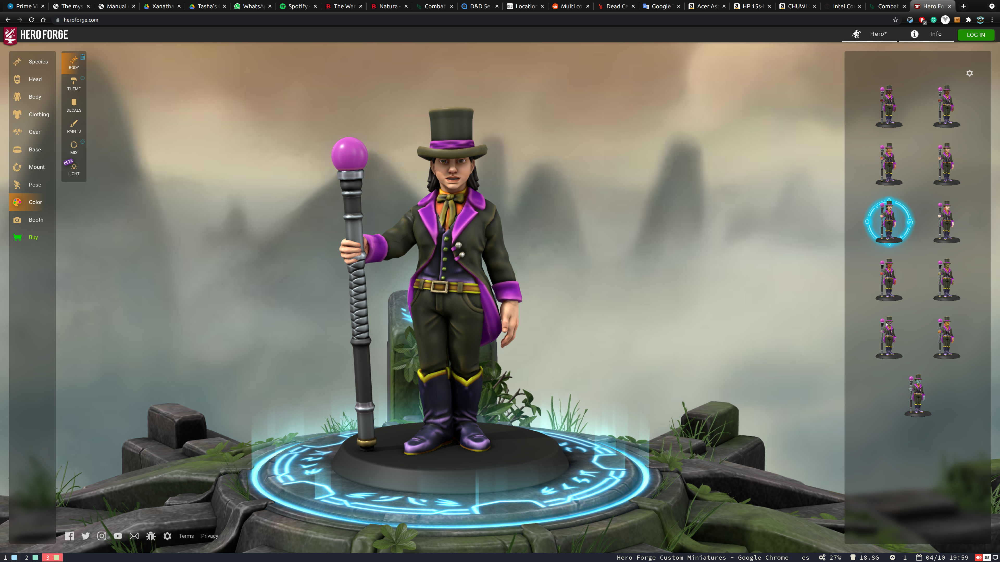

A Circus is in the city 

<!--more-->

Wheaton: Owner of the circus. Has illusion powers. uses the powers for the show.

- Fenix: The fire mage. Creates a show of fire starting as a fenix flying from the sky. Then it dances with fire companions.
- Diana: Throws knives and arrows with high accuracy. First shows his accuracy hitting a target twice. Then a moving target, Then, asks someone from the public to hold an apple.
- Faith: Has the power to turn into animals. Starts by converting into an eagle. flies high and turns into a monkey that grabs a swing to finally convert into a dolphin that falls into a pool. Then she jumps from the pool and comes back to human form as she falls to the ground. (Natura may recognise her as Grace)
- Cody: shows how to tame a Griffon and flights with it around the place. It also allows people to feed it. It will end badly when Draco jumps into the scene and says that there is no danger with the creature.
  - Griffon:  https://online.anyflip.com/duex/ixpz/mobile/index.html#p=175

Pitonisa + Predicciones de futuro.
Unicorn for Wheaton